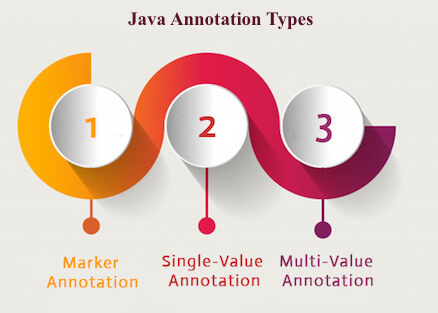

# Adnotacje


|  |  |  |
|-------------------------------------------------|-------------------------------------|----------------------------------------|
|               |  |    |
|              |   |     |
|              |

https://www.edureka.co/blog/java-frameworks/

````````
Adnotacje, forma metadanych, które wprowadzają dane o programie ale nie zmieniają działania poszczególnych części programu.
Adnotacje nie wpływają bezpośrednio na efekt operacji kodu, który pokrywają.
Adnotacje mają wiele właściwości:
    Są informacją dla kompilatora - adnotacje mogą być użyteczne dla kompilatora w celu wykrywanie błędów lub pomijania ostrzeżeń (SupressWarnings).
    Czas kompilacji oraz czas procesu tworzenia aplikacji - frameworki potrafią używać adnotacji w celu generowania kodu, plików XML.
    Niektóre adnotacje mogą zostać użyte już podczas działania programu (Runtime).
````````
Adnotacje są znacznikami.
Adnotacje nie zmieniają sposobu kompilacji programu.
Do najważniejszych zastosowań adnotacji należą:
- Automatyczne generowanie plików pomocniczych takich jak deskryptory wdrożeń 
(web.xml) (adnotacje zastępują konieczność tworzenia pliku) lub klasy informacyjne ziarenek.
- Automatyczne generowanie kodu do testowania, zapisu informacji w dziennikach, semantyki trancakcji.

Oprócz metod adnotacjami możemy oznaczyć również klasy, pola i zmienne lokalne.

Tworząc adnotację należy zdefiniować interfejs adnotacji. Metody tego interfejsu odpowiadają elemenom adnotacij.

``````````
@Target(ElementType.METHOD)
@Retention(RetentionPolicy.RUNTIME)
public @interface Name 
{
Long timeout() default 0L;
}
``````````

Deklaracja @interface tworzy interfejs. Narzędzia, które przetwarzają adnotacje, otrzymują obiekty implementujące interfejs adnotacij. 
Narzędzie wywoła metodę timeout aby pobrać element wybranej adnotacji Name.

Adnotacje Target i Retention są metaadnotacjami. Pierwsza ogranicza elementy, dla których można użyc adnotacji.
Druga określa sposób zachowania adnotacji, który określamy za pomocą co najmniej jednej wartości spośród:
- SOURCE - adnotacje są zachowywane w plikach klas
- CLASS - adnotacje są zachowywane w plikach klas, ale nie są ładowane przez maszynę wirtualną.
- RUNTIME - adnotacje są zachowywane w plikach klas i są ładowane przez maszynę wirtualną. Są wtedy dostępne za pomocą
interfejsu refleksji.

Przetwarzanie adnotacji możliwe jest podczas:
- działania programu
- na poziomie kodu źródłowego
- na pozimie kodu bajtowego.


## Składnia adnotacji
Adnotacja zdefiniowana jest przez interfejs adnotacji:
``````
modyfikatory @interface NazwaAdnotacji
{

}
`````` 
Każda deklaracja elementu posiada postać:
``````
modyfikatory @interface NazwaAdnotacji
{
typ nazwaElementu();
}
``````
lub
``````
modyfikatory @interface NazwaAdnotacji
{
typ nazwaElementu() default wartość;
}
``````

<h4> Metody interfesjów adnotacji nie mają żadnych parametrów ani żadnych klauzul throws. 
Nie mogą być także oznaczone jako metody domyślne lub statyczne ani nie mogą mieć parametrów typów.</h4>

Przykład zawierający poprawne deklaracje elementów:
``````
modyfikatory @interface NazwaAdnotacji
{
enum Dog {AKITA, BLUE_LACY, POLISH_GREYHOUND, IRISH_SETTER, IRISH_TERRIER};
boolean isExist() default false;
String name() default "[none]";
Class<?> testCase default Void.class;
Dog dog() default Dog.AKITA;
Reference ref() default @Reference();
String[] owners();
}
``````

## Użycie adnotacji
Każda a@Localizeddnotacja posiada format:
````````
@NazwaAdnotacji(name: "Mariusz", legNumber: 4)
````````
Kolejność elementów nie ma znaczenia. 
Domyślna wartość podana w deklaracji jest używana, jesli wartość elementu nie została podana.
Jeśli nie podajemy żadnych elementów używane są wartości domyślne a taką wersję nazywamy
adnotacją znacznikową.
https://www.edureka.co/blog/java-frameworks/


## Kategorie adnotaci
#### DEKLARACJI:
Udostępniają pewne informacje na temat deklarowanego elementu.
- pakiety
- klasy(w tym enumy)
- interfejsy
- pola
- zmienne lokalne
- parametry
- parametry typów

#### TYPÓW
Adnotacje zastosowania ytpu można umieszczać w nastepujących miejscach:
- w generychnych argumentach typu ```````` List<@NonNull Sting>  ````````
- w dowolnym miejscu deklaracji tablicy ``````` @NonNull int[] ints ```````
- w klasach bazowych i implementowanych interfejsach `````` class Warnings extends @Localized Message ``````
- w rzutowaniach typów `````` if (text instanceof @Localized String) ``````
- w specyfikacjach wyjątków `````` public String read() throws @Localized IOException; ``````
- przy znakach wieloznacznych oraz ograniczeniach typów `````` List<@Localized ? extends Message> ``````
- w odwołaniach do metod i konstruktorów ``````@Localized Message::getText``````

## Ustalone adnotacje (standardowe)
Istnieje zbiór adnotacji w JAVA SE API. Niektóre z nich używane są przez kompilator a niektóre używane są przez inne adnotacje.
Adnotacje mogą być użyte co do: klasy, pola, metody oraz pozotałych elementów programu (wartości metod)
````
@SuppressWarnings
@Deprecated
@Override
````

Domyślnie adnotacje nie sa dziedziczone. Należy użyć `````` @Inherited`````` aby mogły byc dziedziczone przez dzieci.

# Zadanie
Otwórz poniższe pakiety i przeglądnij adnotacje:
- pakiet: java.lang
- pakiet java.lang.annotation


